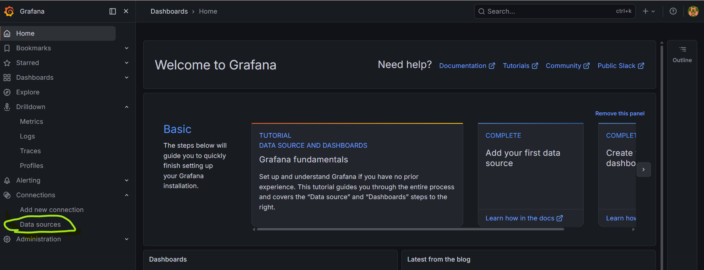
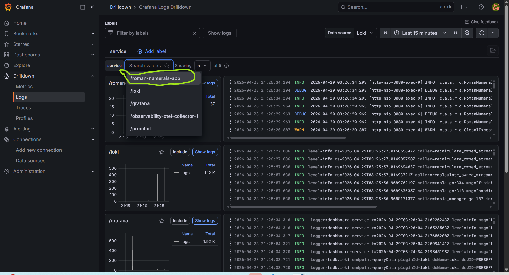
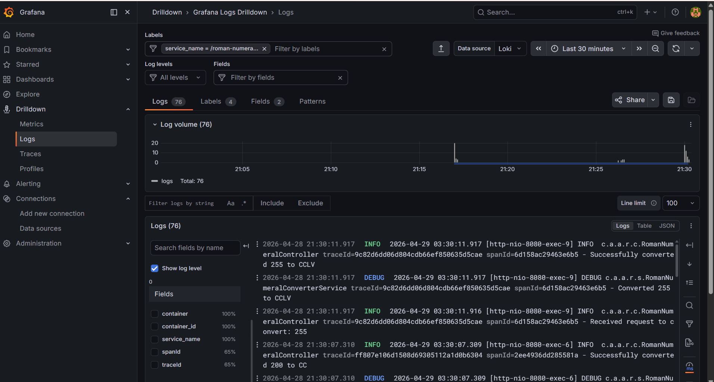

# roman-numeral-converter

**roman-numeral-converter** is a java based spring-boot application that exposes a GET based REST API to convert integer
into it's respective roman numeral representation.
> Developed by: Suhasini Pamidi

## Table of Contents

- [Architecture](#architecture)
- [Frameworks and Technologies Used](#frameworks-and-technologies-used)
- [Packaging Layout](#packaging-layout)
- [How to build and deploy the application](#how-to-build-and-deploy-the-stack)
- [Testing](#testing)
- [Error Handling](#error-handling)
- [CI/CD Pipeline](#cicd-pipeline)
- [Observability](#observability)
- [Sample API Request/Responses](#sample-api-requestresponses)
- [Performance Testing](#simple-performance-testing-results-using-apache-bend)
- [Future Improvements](#future-enhancements)
- [References](#references)

## Architecture


## Frameworks and Technologies Used


| Component | Technology | Version |
|-----------|-----------|---------|
| Language | Java | 17      |
| Framework | Spring Boot | 3.5.14  |
| Build Tool | Maven | 3.9.2   |
| Testing | JUnit 5, Mockito, REST Assured | Latest  |
| Observability | Spring Actuator, Prometheus, Micrometer | Latest  |
| Containerization | Docker | Latest  |
| CI/CD | GitHub Actions | -       |
| Code Quality | SonarQube, JaCoCo | Latest  |

## Packaging Layout


## How to build and deploy the stack?

1. Clone the git repo

```
git clone https://github.com/suhasini86/roman-numerals.git
```

2. Pre-requisite checks for required frameworks

```
java -version
docker -v
docker-compose -v
mvn -v
```

3.  Run the below commands to start the whole application stack along with the devops capabilities as shown in the architecture diagram.
   (Assuming that you're in the root directory of the application git repo, run the below commands)

```
cd observability
docker compose up --d
```

The docker compose will spin the whole docker infra. The
whole process should take around 2 to 3 mins depending on the underlying machine, you should see a similar output as
shown below with status of various services,


Use the below command to refresh the status of the services until you see all the services Up and elasticsearch, kibana
and apm server reported as Up (healthy)

```
docker-compose -f docker-compose.yml ps
```

4. Verify if the deployed services are up and running,

> roman-numeral-converter App - http://localhost:8080/actuator/health
>
> REST API specs - http://localhost:8080/swagger-ui.html
> 
> Prometheus - http://localhost:9090/
>
> Grafana - http://localhost:3000/

5. To run the application in stand-alone mode without any devops capabilities, just run
   the `RomanNumeralConverterApplication` class

## Testing

### Health check

> http://localhost:8080/actuator/health

### Sample test

> http://localhost:8080/romannumeral?query=255

Output:

```
{
"input": "255",
"output": "CCLV"
}
```

### Run Unit/Integration tests

From application root directory, run
> mvn clean install

```
Test Cases:

RomanNumeralConverterControllerTest
- convertIntegerToRomanNumeral_Success - Happy day flow
- convertIntegerToRomanNumeral_lessThanMinError - input number less than min value < 1
- convertIntegerToRomanNumeral_greaterThanMaxError - input number greater than max value > 3999
- convertIntegerToRomanNumeral_inputTypeMismatchError - input value not a valid int number - eg: String value like "plsFail"
- convertIntegerToRomanNumeral_internalServerError - simulating RuntimeException

RomanNumeralConverterServiceImplTest
- convertIntegerToRomanNumeral_Success - multiple happy day assertions

```

### Run Acceptance tests

1. Acceptance tests that can be integrated into the CI/CD pipeline with test cases required to certify the application
   ready for deployment to next stage
2. For this, make sure the application is running, because these tests are executed against the running application,
   simulating a real world flow
3. Use the below command, to run the acceptance tests,

> mvn test -Dtest=IntegerToRomanNumeralConversionAT

```
Acceptance Test Cases

IntegerToRomanNumeralConversionAT
- testDefaultContentTypeIsJson - Validate response content type is application/jso
- testIntegerToRomanNumeralConversion_Success - Happy day case to validate conversion of a valid int to roman numeral
- testIntegerToRomanNumeralConversion_ValidationError_OutOfRange - Error case to validate out of range conversions. Valid range 1 to 3999
- testIntegerToRomanNumeralConversion_ValidationError_InvalidDataType - Error case to validate invalid data type inputs. Valid data type int, range 1 to 3999
```

## Sample API Request/Responses

### Successful Request

```
curl -X GET "http://localhost:8080/romannumeral?query=100"
```

### Successful Response

```
Http Status Code - 200
{
  "input": "100",
  "output": "C"
}
```

### Error Request

```
curl -X GET "http://localhost:8080/romannumeral?query=4000"
```

### Error Response

```
Http Status Code - 400
{
  "statusCode": 400,
  "errorMessage": "Invalid input, enter an integer value in the range from 1 to 3999"
}
```

## Error Handling

    The GlobalExceptionHandler (@RestControllerAdvice) provides centralized, consistent error responses: .

| Exception Type                          | HTTP Status| Scenario                                  |
|-----------------------------------------|------------|-------------------------------------------|
| MissingServletRequestParameterException | 400        | query parameter not provided              |
| IllegalArgumentException                | 400        | Empty/blank query, or value outside range |
| NumberFormatException                   | 400        | Non-numeric input (e.g., ?query=abc)      |
| MethodArgumentTypeMismatchException     | 400        | Type mismatch on request parameter        |
| HttpMessageNotReadableException         | 400        | Malformed request body                    |
| Exception                               | 500        | Any unhandled exception                   |

``` json
{
  "timestamp": "2026-04-27T00:00:00Z",
  "status": 400,
  "error": "Bad Request",
  "message": "Query must be a valid integer"
}
```

## Observability

This project includes simple observability to monitor application behavior using metrics, traces, and logs.

### Overview

### Metrics
- Metrics are exposed using Spring Boot Actuator and Micrometer
- Prometheus collects:
    - Request count
    - Response time
    - Error rates
- Visualized in :contentReference[oaicite:0]{index=0}

### Traces
- Distributed tracing is enabled using OpenTelemetry
- Traces are sent to collector and viewed in :contentReference[oaicite:1]{index=1}
- Helps track request flow

### Logs
- Logs are generated using Logback
- Includes `traceId` and `spanId`
- Logs are sent using Promtail → Loki → Grafana

---

### Data Flow

### Metrics
Application → Actuator → Prometheus → Grafana

### Traces
Application → OpenTelemetry → Collector → Jaeger

### Logs
Application → Logback → Promtail → Loki → Grafana

---

### Grafana setup

> http://localhost:3000/

1. Default username/password for Grafana is admin/admin, you might want to setup a new password when logging in for the
   first time. After logging in, you should see a home screen like below.`,
   

2. Have Preconfigured data sources for Prometheus, Loki and Jaeger. Click on data sources under configuration in left panel, to view the preconfigured data sources.
    


3. Metrics: To view the metrics, click on Metrics under Drilldown in left panel and select Metrics, will display all the metrics. You can also filter the metrics by name, for example, to view the http server request metrics, you can search for `http.server.requests` metric as shown below,
   

4. Logs: To view the logs, click on Logs under Drilldown in left panel and select Logs, will display all the logs. You can also filter the logs by service name, for example, to view the logs for roman-numeral-converter service, you can search for `service="roman-numeral-converter"` as shown below,
   
   

5. Traces: To view the traces, click on explorer in left panel and select Jaeger data source. Enter the trace id to see the traces of a request, you can get the trace id from the logs or from the metrics. For example, to view the traces for a request with trace id `d9b1c8e5f8a7b6c4`, you can enter the trace id in the search box and click on search to view the traces as shown below,
   


## CI/CD Pipeline

### GitHub Actions Workflow

The CI/CD pipeline includes:

1. **Build & Test**
    - Compile code
    - Run unit tests
    - Run integration tests
    - Code coverage

2. **Docker Build & Push**
    - Build multi-stage Docker image
    - Push to container registry

3. **Security Scanning**
    - Trivy vulnerability scan
    - SARIF report upload

4. **Code Quality**
    - SonarQube analysis
    - Code coverage metrics

### Pipeline Status
Sample rin from github actions,

```
Push to main
    ↓
Build & Test (parallel jobs)
    ├── Unit Tests
    ├── Integration Tests
    └── Code Coverage
    ↓
Docker Build & Push
    ↓
Security Scanning
    ↓
Code Quality Analysis
    ↓
Notify
```

## Simple Performance testing results using Apache Bend


## How to un-install Stack?

For convenience to un-install the application, I have bundled the required commands in one shell script, you can just
run the shell script or run individual commands in the shell script by yourself to stop the whole application stack
along with the devops capabilities,
(Assuming that you're in the root directory of the application git repo)

```
cd docker
sh stopWholeStack.sh
```

## Future Enhancements

### Extension 1: Range 1--3999

    The conversion algorithm already supports the full standard Roman numeral range (1-3999).
    The VALUES and SYMBOLS arrays include all mappings up to M (1000). To enable this, only
    one constant change is required:
    // In RomanNumeralsConstants.java
    // Change:
    // public static final int MAX_VALUE = 255;
    public static final int MAX_VALUE = 3999;
    No changes to the conversion logic are needed — only update the constant and corresponding
    test assertions.

### Extension 2: Range Query API
    Add a new query format for bulk conversion of a range of integers using parallel computation.
    Endpoint: GET /romannumeral?min={integer}&max={integer}

### Rules:

    ● Both min and max are required and must be valid integers=
    ● min must be less than max
    ● Both must be within the supported range (1-255, or 1-3999 with Extension 1)
    ● Conversions are computed in parallel using Java multithreading=
    ● Results are returned in ascending order

    Example Request: GET /romannumeral?min=1&max=3
    
    Example Response:
    {
    "conversions": [
        { "input": "1", "output": "I" },=
        { "input": "2", "output": "II" },
        { "input": "3", "output": "III" }
        ]
    }

### Implementation Approach:


    ● Use IntStream.rangeClosed(min, max).parallel() or a ForkJoinPool to compute
    conversions concurrently
    
    ● Collect results into a sorted list before serializing the response
    
    ● Add a RangeConversionResponse DTO with a List<RomanNumeralResponse>
    
    conversions field
    
    ● Validate min < max and both within range in the controller/service layer.

## References

1. [Roman Numeral Wikipedia Reference](https://simple.wikipedia.org/wiki/Roman_numerals)
2. [spring-boot](https://spring.io/projects/spring-boot)
3. [docker-compose](https://docs.docker.com/compose/)
4. [Prometheus & Grafana](https://grafana.com/docs/grafana/latest/getting-started/getting-started-prometheus/)


   


