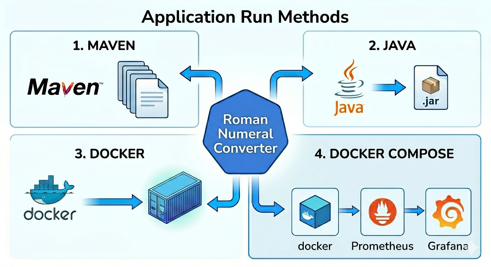
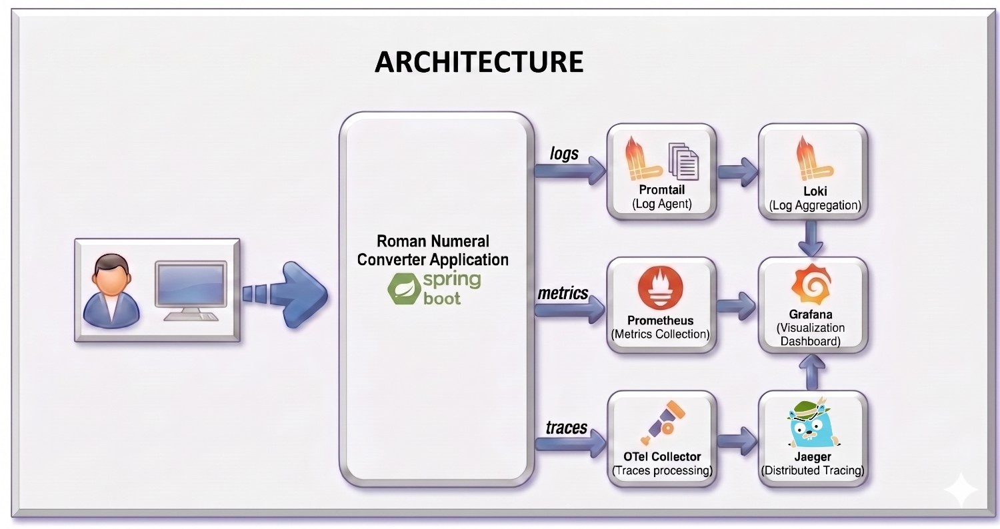

# Roman Numerals Converter API

    A production-ready Spring Boot REST API that converts integers to Roman
    numerals, with full observability and  docker containerization support.

------------------------------------------------------------------------

## 📚 Table of Contents
    -   
    -   Quick Start (#Quick Start)
    -   
    -   API Reference
    -   Engineering Methodology
    -   Testing Methodology
    -   Error Handling
    -   Project Layout
    -   Observability
    -   CI/CD (GitHub Actions)
    -   Future Enhancements

------------------------------------------------------------------------
## Architecture


## 🚀 Quick Start

### Prerequisites
    Before starting, make sure you have the following installed in your local environment:
        -   Java 17+
        -   Maven 3.9+ (or use the included Maven wrapper `./mvnw`)
        -   Docker (optional for observability stack)

### Build the Project

```bash
# Clone the repository
git clone https://github.com/suhasini86/roman-numerals.git
cd roman-numerals

# Build the project with Maven
mvn clean install

# Build with tests
mvn clean verify

# Skip tests (not recommended for production)
mvn clean package -DskipTests

```

## 🚀 Running the Application


### Method 1: Run Locally with Maven

```bash
mvn spring-boot:run
```

### Method 2: Run with Java

```bash
mvn clean package
java -jar target/roman-numerals-1.0.0.jar
```

### Method 3: Docker
    To build and run the application in a Docker container, make sure you have Docker installed and running on your machine, then execute the following commands:
```bash
# Build image
docker build -t roman-numerals:latest .

# Run container
docker run -p 8080:8080 roman-numerals:latest
```

### Method 4: Docker Compose (with Prometheus and Grafana)

    To run the full observability stack with the API, Prometheus, Grafana, and OpenTelemetry Collector. 
    Reference on how to access the dash boards were provided in the Observability section below.
```bash
    cd observability
    docker-compose up -d
```

## 🧪 Test the API
    You can test the API using curl or any HTTP client (e.g., Postman, Insomnia).
    Here’s an example of how to call the API:
Mac
``` bash
curl http://localhost:8080/romannumeral?query=42
```
Windows (PowerShell)
``` powershell
curl.exe -i "http://localhost:8080/romannumeral?query=42"
```
    Response:
    
    ``` json
    {
      "input": "42",
      "output": "XLII"
    }
```

------------------------------------------------------------------------

## 📘 API Reference

### GET `/romannumeral?query={integer}`

    Converts an integer to Roman numeral.

#### Parameters

      Name    Type     Required   Description
      ------- -------- ---------- ------------------
      query   string   Yes        Integer (1--255)

#### Success Response (200)

``` json
{
  "input": "42",
  "output": "XLII"
}
```

#### Error Response (400)

``` json
{
  "timestamp": "2026-04-27T00:00:00Z",
  "status": 400,
  "error": "Bad Request",
  "message": "Query range must be between 1 and 255"
}
```

## ⚙️ Engineering Methodology

### Design Principles
    ● Separation of Concerns — Clear layering: Controller → Service → Constants. The
    controller handles HTTP concerns (parsing, response building), the service owns
    business logic (validation, conversion), and constants are centralized in a single class.
    
    ● Greedy Algorithm — The Roman numeral conversion uses a greedy subtraction
    algorithm with parallel value/symbol arrays. This is O(1) — bounded by 13 symbol
    iterations regardless of input — making it highly efficient and easy to extend.

    ●  Defensive Input Handling — Input is accepted as a String, trimmed, and validated at
    multiple layers (empty/blank check in controller, range check in service) before
    conversion.

     ● Centralized Error Handling — A @RestControllerAdvice (GlobalExceptionHandler)
    catches all exception types and maps them to structured JSON error responses with
    consistent format, timestamps, and HTTP status codes.

     ● Observability-First — Integrated from the start with Micrometer, OpenTelemetry tracing,
    and Prometheus metrics. Distributed trace IDs (traceId, spanId) are injected into every log
    line via the logback pattern.

     ● Production-Ready Configuration — Kubernetes manifests include health probes
    (liveness, readiness, startup), HPA, PDB, RBAC, network policies, and security contexts.

## Inline Documentation

### All source classes include Javadoc comments documenting:
    ● Class-level purpose and design rationale
    ● Method-level @param, @return, and @throws contracts
    ● Inline comments for non-obvious logic

------------------------------------------------------------------------

## Testing Methodology


## Running Tests
``` bash
# Run all tests (unit + integration)
    ./mvnw clean test
    
# Run full verification (includes integration tests)
    ./mvnw verify
# Run a specific test class
    ./mvnw test -Dtest=RomanNumeralConverterServiceTest
``` 
# Code Coverage
    ● JaCoCo is configured with a 90% line coverage minimum enforced at build time.
    ● Coverage report is generated at target/site/jacoco/index.html after running tests.
# Generate and view coverage report
    ./mvnw clean test
    open target/site/jacoco/index.html
# Load Testing
    The RomanNumeralApiLoadTest runs 400 requests with 20 concurrent threads, including a
    warm-up phase. It asserts:
        ● Zero failures across all requests
        ● Average latency < 250ms
        ● P95 latency < 500ms

| Category    | Class                                   | Description                          |
|-------------|------------------------------------------|--------------------------------------|
| Unit Tests  | RomanNumeralConverterServiceTest         | Tests conversion logic               |
| Unit Tests  | RomanNumeralsConstantsTest               | Verifies constant values             |
| Unit Tests  | RomanNumeralControllerUnitTest           | Controller logic with mocked service |
| WebMvc Tests| RomanNumeralControllerWebMvcTest         | HTTP layer testing                   |
| Integration | RomanNumeralControllerIntegrationTest    | Full Spring Boot context             |
| Integration | RomanNumeralsApplicationTests            | Application context loads            |
| Exception   | GlobalExceptionHandlerTest               | Exception handling coverage          |
| Load Tests  | RomanNumeralApiLoadTest                  | Concurrent load testing              |
------------------------------------------------------------------------

## Error Handling

    The GlobalExceptionHandler (@RestControllerAdvice) provides centralized, consistent error responses: .

| Exception Type                          | HTTP Status| Scenario                                  |
|-----------------------------------------|------------|-------------------------------------------|
| MissingServletRequestParameterException | 400        | query parameter not provided              |
| IllegalArgumentException                | 400        | Empty/blank query, or value outside range |
| NumberFormatException                   | 400        | Non-numeric input (e.g., ?query=abc)      |
| MethodArgumentTypeMismatchException     | 400        | Type mismatch on request parameter        |
| HttpMessageNotReadableException         | 400        | Malformed request body                    |
| Exception                               | 500        | Any unhandled exception                   |

    | Exception Type | HTTP Status | Scenario |
    |---------------|------------|----------|
    | MissingServletRequestParameterException | 400 | query not provided |
    | IllegalArgumentException | 400 | invalid input |
    | NumberFormatException | 400 | non-numeric |
    | MethodArgumentTypeMismatchException | 400 | type mismatch |
    | HttpMessageNotReadableException | 400 | malformed body |
    | Exception | 500 | Any unhandled exception |

``` json
{
  "timestamp": "2026-04-27T00:00:00Z",
  "status": 400,
  "error": "Bad Request",
  "message": "Query must be a valid integer"
}
```

------------------------------------------------------------------------
## CI/CD (GitHub Actions)
    The .github/workflows/ci-cd.yml pipeline runs on push/PR to main and develop:
        1. Build & Test - Compile, unit + integration tests, upload coverage to Codecov
        2. Docker Build & Push - Build image and push to GitHub Container Registry (on push
           only)
        3. Security Scan - Trivy vulnerability scanning with SARIF upload to GitHub Security tab
        4. Code Quality - SonarQube static analysis
        5. Notification - Build status reporting via GitHub Checks and optional Slack integration.
-----------------------------------------------------------------------------------
## 📊 Full Observability Stack

### Metrics (Prometheus + Grafana)
    ● Micrometer exports application metrics to the /actuator/prometheus endpoint.
    ● Prometheus scrapes metrics at a configured interval.
    ● Grafana dashboards are auto-provisioned for visualizing. A custom dashboard is included for
    the Roman numeral conversion API, showing request counts,latencies, and error rates.
### Distributed Tracing (OpenTelemetry)
    ● Micrometer Tracing Bridge integrates with OpenTelemetry to generate trace spans for
    every request.
    ● Traces are exported via OTLP HTTP to the OpenTelemetry Collector (port 4318).
    ● traceId and spanId are injected into every log line for correlation.
### Structured Logging
    Log pattern includes trace context for end-to-end request correlation:
    2026-04-27 10:00:00.000 [http-nio-8080-exec-1] INFO  
    c.a.a.r.controller.RomanNumeralController traceId=abc123 spanId=def456 - Received...

    To view the full observability stack with Prometheus metrics, Grafana dashboards, and OpenTelemetry tracing,
    run the following command from the `observability` directory:
``` bash
    cd observability
    docker compose up --build

```
      Service                 URL
      ----------------------- -----------------------
      Health                  http://localhost:8080/actuator/health

      Metrics                 http://localhost:8080/actuator/info
    
      Prometheus              http://localhost:9090
    
      Grafana                 http://localhost:3000

------------------------------------------------------------------------

## 📁 Project Layout

    roman-numerals/
    ├── pom.xml                                  # Maven build config & dependency management
    ├── Dockerfile                               # Multi-stage Docker build (build + runtime)
    ├── mvnw/mvnw.cmd                            # Maven wrapper (no local Maven install needed)
    ├── src/main/java/com/adobe/aem/romannumerals/
    │   ├── RomanNumeralsApplication.java        # Spring Boot entry point
    │   ├── constants/
    │   │   └── RomanNumeralsConstants.java      # Centralized constants (ranges, error messages)
    │   ├── controller/
    │   │   └── RomanNumeralController.java      # REST endpoint: GET /romannumeral?query=
    │   ├── dto/
    │   │   ├── RomanNumeralResponse.java        # Success response DTO
    │   │   └── ErrorResponse.java               # Error response DTO
    │   ├── exception/
    │   │   └── GlobalExceptionHandler.java      # @RestControllerAdvice for all exceptions
    │   └── service/
    │       └── RomanNumeralConverterService.java # Conversion logic (greedy algorithm)
    ├── src/main/resources/
    │   ├── application.yaml                     # App config (actuator, tracing, OTLP)
    │   └── logback-spring.xml                   # Logging with traceId/spanId in output
    ├── src/test/java/com/adobe/aem/romannumerals/
    │   ├── RomanNumeralsApplicationTests.java   # Context load test + Main method coverage
    │   ├── constants/
    │   │   └── RomanNumeralsConstantsTest.java  # Constants verification
    │   ├── controller/
    │   │   ├── RomanNumeralControllerUnitTest.java       # Unit tests (mocked service)
    │   │   ├── RomanNumeralControllerWebMvcTest.java     # MockMvc HTTP-layer tests
    │   │   └── RomanNumeralControllerIntegrationTest.java # Full integration tests
    │   ├── exception/
    │   │   └── GlobalExceptionHandlerTest.java  # Exception handler branch tests
    │   ├── load/
    │   │   └── RomanNumeralApiLoadTest.java     # Concurrent load test (20 threads)
    │   └── service/
    │       └── RomanNumeralConverterServiceTest.java # Service unit tests
    ├── k8s/
    │   └── deployment.yaml                      # K8s manifests (Namespace, Deployment, Service, HPA, PDB, RBAC, NetworkPolicy)
    ├── observability/
    │   ├── docker-compose.yml                   # Full observability stack (app + Prometheus + Grafana + OTel)
    │   ├── prometheus/prometheus.yml            # Prometheus scrape config
    │   ├── grafana/                             # Pre-built Grafana dashboards
    │   │   ├── dashboards/
    │   │   └── provisioning/                    # Auto-provisioned datasources & dashboards
    │   └── otel-collector-config.yaml           # OpenTelemetry Collector pipeline config
    └── .github/workflows/
    └── ci-cd.yml                            # GitHub Actions CI/CD pipeline

------------------------------------------------------------------------

## Future Enhancements

### Extension 1: Range 1--3999

    The conversion algorithm already supports the full standard Roman numeral range (1-3999).
    The VALUES and SYMBOLS arrays include all mappings up to M (1000). To enable this, only
    one constant change is required:
    // In RomanNumeralsConstants.java
    // Change:
    // public static final int MAX_VALUE = 255;
    public static final int MAX_VALUE = 3999;
    No changes to the conversion logic are needed — only update the constant and corresponding
    test assertions.

### Extension 2: Range Query API
    Add a new query format for bulk conversion of a range of integers using parallel computation.
    Endpoint: GET /romannumeral?min={integer}&max={integer}

### Rules:

    ● Both min and max are required and must be valid integers=
    ● min must be less than max
    ● Both must be within the supported range (1-255, or 1-3999 with Extension 1)
    ● Conversions are computed in parallel using Java multithreading=
    ● Results are returned in ascending order

    Example Request: GET /romannumeral?min=1&max=3
    
    Example Response:
    {
    "conversions": [
        { "input": "1", "output": "I" },=
        { "input": "2", "output": "II" },
        { "input": "3", "output": "III" }
        ]
    }

### Implementation Approach:


    ● Use IntStream.rangeClosed(min, max).parallel() or a ForkJoinPool to compute
    conversions concurrently
    
    ● Collect results into a sorted list before serializing the response
    
    ● Add a RangeConversionResponse DTO with a List<RomanNumeralResponse>
    
    conversions field
    
    ● Validate min < max and both within range in the controller/service layer.


------------------------------------------------------------------------
