# roman-numeral-converter

**roman-numeral-converter** is a java based spring-boot application that exposes a GET based REST API to convert integer
into it's respective roman numeral representation.
> Developed by: Suhasini Pamidi

## Table of Contents

- [Architecture](#architecture)
- [Frameworks and Technologies Used](#frameworks-and-technologies-used)
- [Packaging Layout](#packaging-layout)
- [How to build and deploy the application](#how-to-build-and-deploy-the-stack)
- [Testing](#testing)
- [Error Handling](#error-handling)
- [CI/CD Pipeline](#cicd-pipeline)
- [Observability](#observability)
- [Sample API Request/Responses](#sample-api-requestresponses)
- [Future Improvements](#future-enhancements)
- [References](#references)

## Architecture


## Frameworks and Technologies Used


| Component | Technology | Version |
|-----------|-----------|---------|
| Language | Java | 17      |
| Framework | Spring Boot | 3.5.14  | 
| Build Tool | Maven | 3.9.2   |
| Testing | JUnit 5, Mockito, REST Assured | Latest  |
| Observability | Spring Actuator, Prometheus, Micrometer | Latest  |
| Containerization | Docker | Latest  |
| CI/CD | GitHub Actions | -       |
| Code Quality | SonarQube, JaCoCo | Latest  |

## Packaging Layout

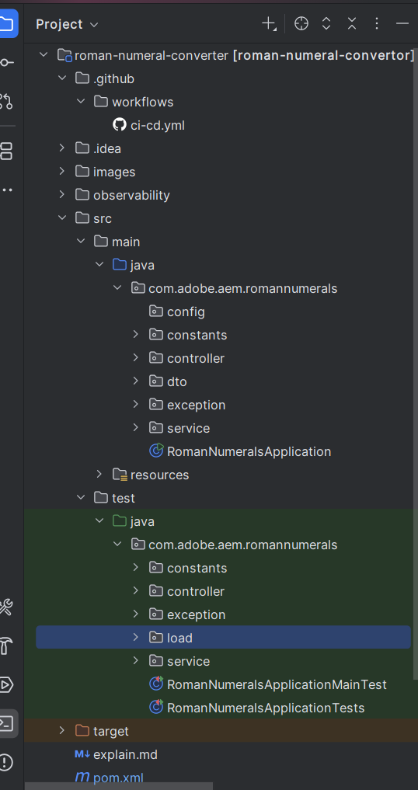

## How to build and deploy the stack?

1. Clone the git repo

```
git clone https://github.com/suhasini86/roman-numerals.git
```

2. Pre-requisite checks for required frameworks

```
java -version
docker -v
docker-compose -v
mvn -v
```

3.  Run the below commands to start the whole application stack along with the observability capabilities as shown in the architecture diagram.
   (Assuming that you're in the root directory of the application git repo, run the below commands)

```
cd observability
docker-compose pull
docker-compose up -d
```

The docker compose will spin the whole docker infra. The
whole process should take around 2 to 3 mins depending on the underlying machine. Output will be as shown below with status of various services,

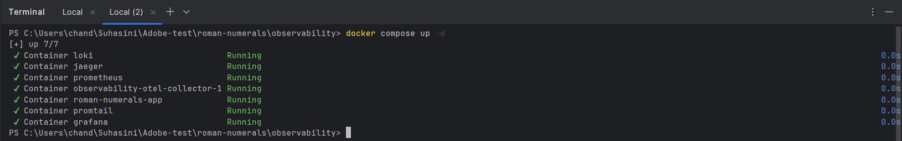

Use the below command to refresh the status of the services until all the services up.

```
docker-compose -f docker-compose.yml ps
```

4. Verify if the deployed services are up and running,

> roman-numeral-converter App - http://localhost:8080/actuator/health
> 
> Swagger UI - http://localhost:8080/swagger-ui.html
> 
> OpenAPI Specification - http://localhost:8080/v3/api-docs
> 
> Prometheus - http://localhost:9090/
>
> Grafana - http://localhost:3000/
> 
> Jaeger - http://localhost:16686/
> 

5. To run the application in stand-alone mode without any devops capabilities, just run
   the `RomanNumeralsApplication`class
``` bash
powershell
> $env:SPRING_PROFILES_ACTIVE = "standalone"
> mvn: spring-boot:run
mac
> export SPRING_PROFILES_ACTIVE=standalone
> mvn spring-boot:run

```

## Testing

### Health check

> http://localhost:8080/actuator/health

### Sample test

> http://localhost:8080/romannumeral?query=255

Output:

```
{
"input": "255",
"output": "CCLV"
}
```

### Running Unit/Integration Tests
``` bash
From application root directory: 

# Run all tests (unit + integration)
    mvn clean test

# Run full verification (includes integration tests)
    mvn verify
# Run a specific test class
    mvn test -Dtest=RomanNumeralConverterServiceTest
``` 

### Load Testing

#### Run load tests
Use the below command to run the load tests for the API.
``` bash
    mvn test -Dtest=RomanNumeralApiLoadTest
```

`The RomanNumeralApiLoadTest` runs 400 requests with 20 concurrent threads, including a
    warm-up phase. It asserts:

● Zero failures across all requests

● Average latency < 250ms

● P95 latency < 500ms

Sample load test results from a run are shown below, demonstrating that the API can handle concurrent requests efficiently while maintaining low latency and zero errors.
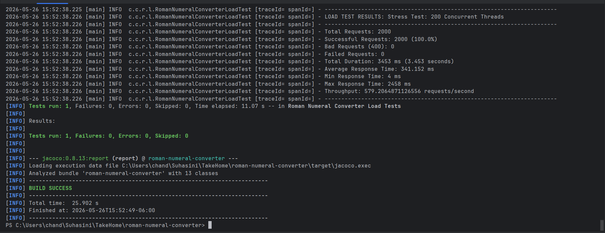

### Code Coverage
●  JaCoCo is configured with a 90% line coverage minimum enforced at build time.

● Coverage report is generated at target/site/jacoco/index.html after running tests.
### Generate and view coverage report
    mvn clean test
    open target/site/jacoco/index.html

| Category    | Class                                   | Description                          |
|-------------|------------------------------------------|--------------------------------------|
| Unit Tests  | RomanNumeralConverterServiceTest         | Tests conversion logic               |
| Unit Tests  | RomanNumeralsConstantsTest               | Verifies constant values             |
| Unit Tests  | RomanNumeralControllerUnitTest           | Controller logic with mocked service |
| WebMvc Tests| RomanNumeralControllerWebMvcTest         | HTTP layer testing                   |
| Integration | RomanNumeralControllerIntegrationTest    | Full Spring Boot context             |
| Integration | RomanNumeralsApplicationTests            | Application context loads            |
| Exception   | GlobalExceptionHandlerTest               | Exception handling coverage          |
| Load Tests  | RomanNumeralApiLoadTest                  | Concurrent load testing              |
------------------------------------------------------------------------

## Sample API Request/Responses

### Successful Request

```
curl -X GET "http://localhost:8080/romannumeral?query=200"
```

### Successful Response

```
Http Status Code - 200
{
  "input": "200",
  "output": "CC"
}
```

### Error Request

```
curl -X GET "http://localhost:8080/romannumeral?query=abc"
```

### Error Response

```
Http Status Code - 400
{
  "timestamp": "2026-04-27T00:00:00Z",
  "status": 400,
  "error": "Bad Request",
  "message": "Query must be a valid integer"
}
```

## Error Handling

The GlobalExceptionHandler (@RestControllerAdvice) provides centralized, consistent error responses. It handles specific exceptions related to request validation and type mismatches, returning a structured JSON error response with appropriate HTTP status codes.

| Exception Type                          | HTTP Status| Scenario                                  |
|-----------------------------------------|------------|-------------------------------------------|
| MissingServletRequestParameterException | 400        | query parameter not provided              |
| IllegalArgumentException                | 400        | Empty/blank query, or value outside range |
| NumberFormatException                   | 400        | Non-numeric input (e.g., ?query=abc)      |
| MethodArgumentTypeMismatchException     | 400        | Type mismatch on request parameter        |
| HttpMessageNotReadableException         | 400        | Malformed request body                    |
| Exception                               | 500        | Any unhandled exception                   |

``` json
{
  "timestamp": "2026-04-27T00:00:00Z",
  "status": 400,
  "error": "Bad Request",
  "message": "Query must be a valid integer"
}
```

## Observability

This project includes simple observability to monitor application behavior using metrics, traces, and logs.

### Overview

### Metrics
- Metrics are exposed using Spring Boot Actuator and Micrometer
- Prometheus collects:
    - Request count
    - Response time
    - Error rates
### Traces
- Distributed tracing is enabled using OpenTelemetry
- Helps track request flow
### Logs
- Logs are generated using Logback
- Includes `traceId` and `spanId`
- Logs are sent using Promtail → Loki → Grafana
---
### Data Flow
### Metrics
Application → Actuator → Prometheus → Grafana
### Traces
Application → OpenTelemetry → Collector → Jaeger
### Logs
Application → Logback → Promtail → Loki → Grafana

---

### Grafana setup

> http://localhost:3000/

1. The default Grafana login credentials are admin/admin. For security purposes, you will be prompted to set a new password upon your first login. After successfully signing in, you should see a home screen similar to the one shown below.
   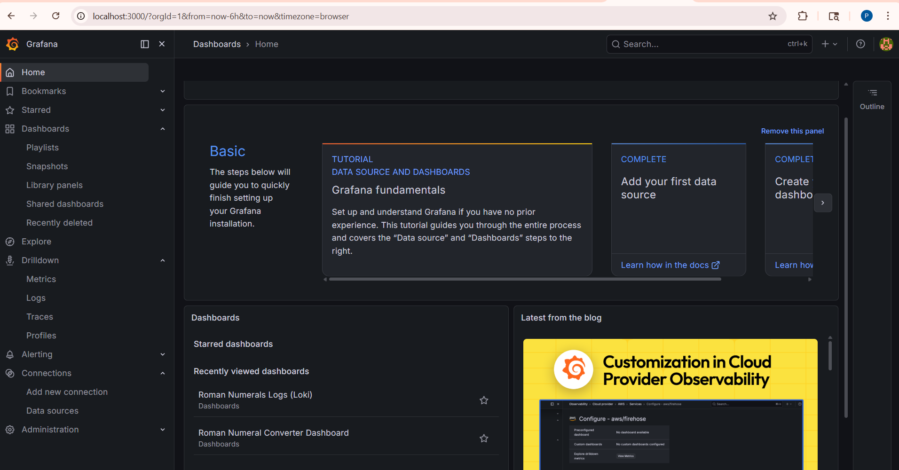

2. Preconfigured data sources for Prometheus, Loki, and Jaeger are already available. To review them, navigate to Configuration → Data Sources in the left-hand panel, where you can view and manage the existing configurations.
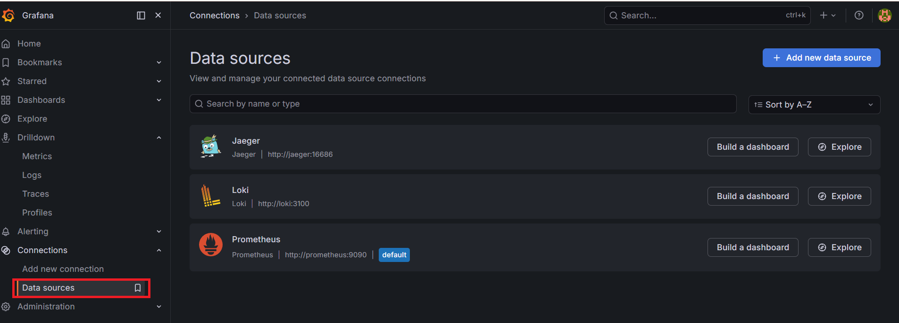

3. `Metrics:` To explore application metrics, navigate to Drilldown → Metrics in the left-hand panel. This view displays all available metrics. You can refine the results using the search bar—for example, enter http.server.requests to view HTTP server request metrics, as illustrated below.
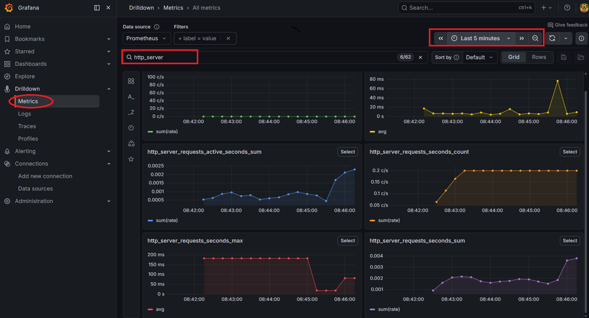
   Preconfigured metrics dashboard is also available under Dashboards. To access follow the steps as shown in below screenshots.
   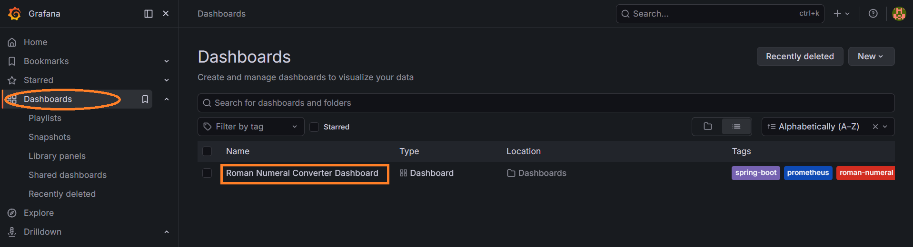
   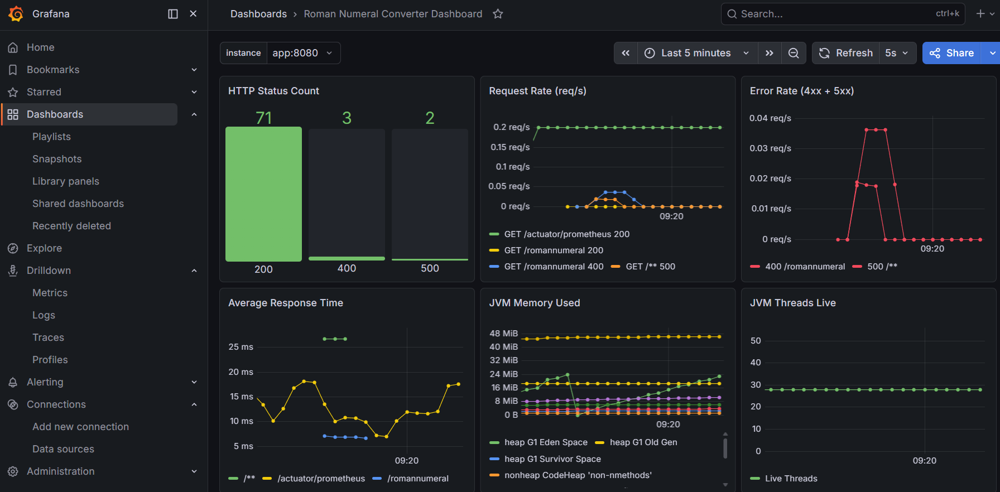

4. `Logs:` To access application logs, navigate to Drilldown → Logs in the left-hand panel. This view displays all available logs.

    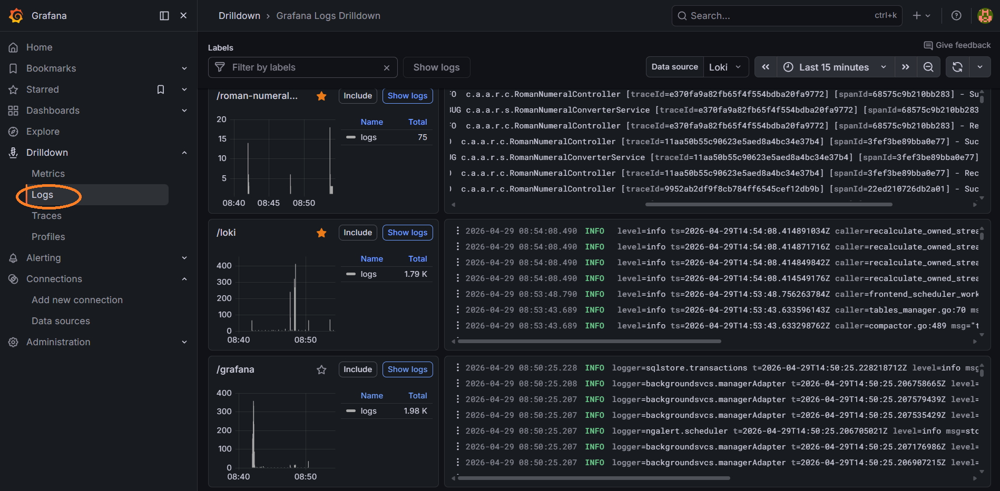

    You can filter logs using labels—for example, to view logs for the roman-numeral-converter service, apply the filter service="roman-numeral-converter", as shown below.
    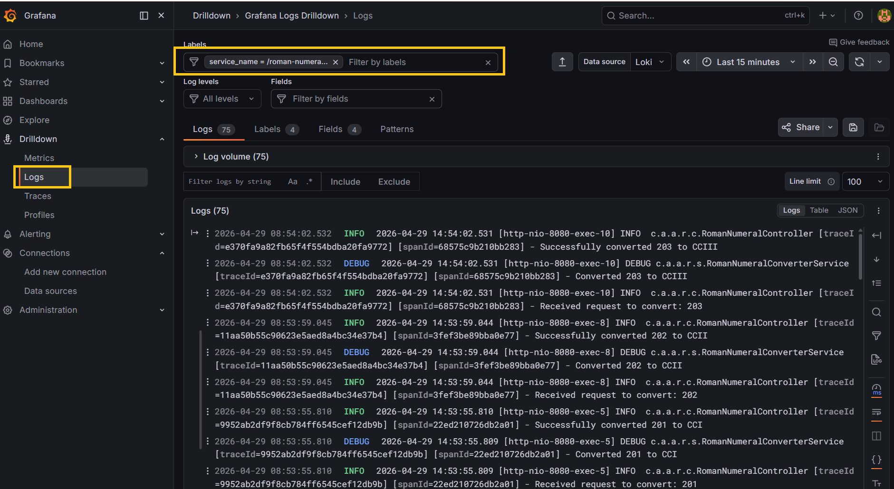

5. `Traces:` To explore distributed traces, navigate to Explore from the left-hand panel and select the Jaeger data source. You can retrieve the relevant `TraceId` from logs or metrics. Enter the traceId in the search field and execute the query to visualize the trace details for a specific request. For example, to view traces for the request with traceId = e370fa9a82fb65f4f554bdba20fa9772, enter the value in the search box and click Search, as illustrated below.
   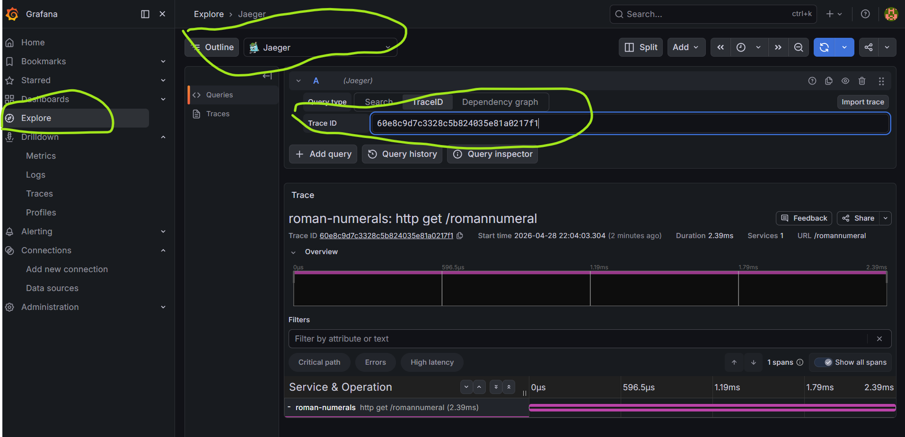


## CI/CD Pipeline

### GitHub Actions Workflow

The CI/CD pipeline includes:

1. **Build & Test**
    - Compile code
    - Run unit tests
    - Run integration tests
    - Code coverage

2. **Docker Build & Push**
    - Build multi-stage Docker image
    - Push to container registry
    - which can be used to deploy the application in any environment (dev, staging, prod)
    - Sample Docker hub registry screenshot:
   - 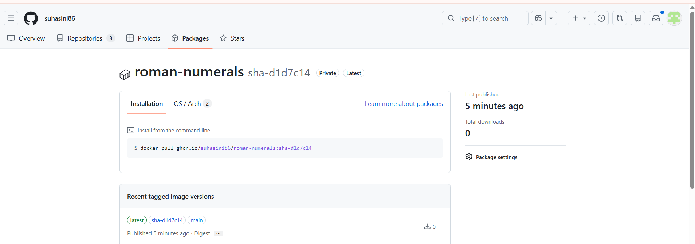

3. **Security Scanning**
    - Trivy vulnerability scan
    - SARIF report upload

4. **Code Quality**
    - SonarQube analysis
    - Code coverage metrics

### Pipeline Status
Sample workflow run from github actions,
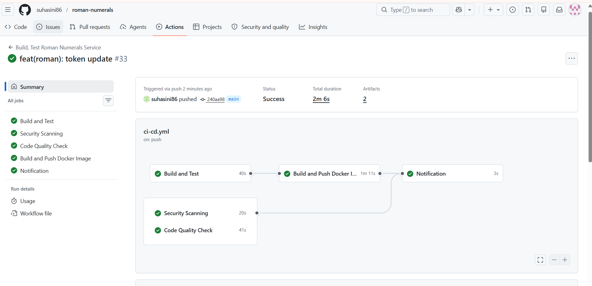


## Future Enhancements

### Extension 1: Range 1--3999
The conversion algorithm already supports the full standard Roman numeral range (1-3999). The `VALUES` and `SYMBOLS` arrays include all mappings up to M (1000). To enable this, only one constant change is required:

// Changes to support range 1-3999:
In `RomanNumeralsConstants.java` change the MAX_VALUE constant from 255 to 3999.

No changes to the conversion logic are needed — only updating the `MAX_VALUE` constant and corresponding test assertions.

### Extension 2: Range Query API
Add a new query format for bulk conversion of a range of integers using parallel computation.

Endpoint: GET /romannumeral?min={integer}&max={integer}

### Rules:

    ● Both min and max are required and must be valid integers
    ● min must be less than max
    ● Both must be within the supported range (1-255, or 1-3999 with Extension 1)
    ● Conversions are computed in parallel using Java multithreading
    ● Results are returned in ascending order

    Example Request: GET /romannumeral?min=1&max=3
    
    Example Response:
    {
    "conversions": [
        { "input": "1", "output": "I" },
        { "input": "2", "output": "II" },
        { "input": "3", "output": "III" }
        ]
    }

### Implementation Approach:

● Use `IntStream.rangeClosed(min, max).parallel()` or a `ForkJoinPool` to compute conversions concurrently

● Collect results into a sorted list before serializing the response
    
● Add a `RangeConversionResponse` DTO with a `List<RomanNumeralResponse>` conversions field
    
● Validate `min < max` and both within range in the controller/service layer.

## References

1. [Roman Numeral Wikipedia Reference](https://simple.wikipedia.org/wiki/Roman_numerals)
2. [spring-boot](https://spring.io/projects/spring-boot)
3. [docker-compose](https://docs.docker.com/compose/)
4. [Prometheus & Grafana](https://grafana.com/docs/grafana/latest/getting-started/getting-started-prometheus/)


   


